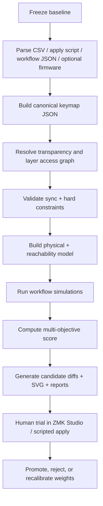
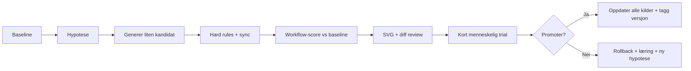

# Robust metodikk for iterativ forbedring av Charybdis-keymap

## Executive summary

Den riktige retningen er å bygge en **egen Charybdis-spesifikk analyse- og optimaliseringspipeline** med fire faste lag: **kanonisk modell**, **synk-/regelvalidering**, **workflow-simulering**, og **kandidatgenerering med menneske-i-løkken**. Det forrige svaret var retning-riktig om behovet for et eget beslutningssystem, beskyttede posisjoner, workflow-fokus og konservative kandidatendringer, men det trengte skarpere spesifikasjon for ZMK-risiko, synkronisering mellom filer, transparente lag, testbar eksportflyt og sammenligning mot baseline. Handoffen gjør det klart at dette ikke er et vanlig layoutproblem: høyrehånden har trackball under tommelen, lag aktiveres via tommelhold, `x0`-transparent fall-through er bevisst design, og CSV, Studio/apply-script og workflow-JSON må holdes i lås. fileciteturn0file0 fileciteturn0file1

Eksisterende verktøy skal brukes som **hjelpekomponenter**, ikke som sannhetsmotor. ZMK Studio er nyttig for runtime-testing, men dokumentasjonen sier eksplisitt at det ikke kan definere nye behaviors eller nye fysiske layouts, og at Studio-administrerte endringer kan gjøre at senere `.keymap`-endringer ikke brukes før “Restore Stock Settings” kjøres. Keymap Editor og keymap-drawer er gode for redigering og visualisering. Oxeylyzer, Kühlmak og Carpalx gir gode idéer for scorer, corpusarbeid, pins/protected keys og søkestrategier, men de forstår ikke Charybdis-spesifikke tommelkonflikter, trackball-samtidighet eller `coach_*`-makroer. citeturn3view0turn5view0turn8view4turn8view0turn8view1turn8view2

Den beste praktiske planen er derfor: **frys baseline**, parse alle kilder til én kanonisk JSON, bygg en fysisk modell og et lag-/reachability-graf, kjør harde valideringsregler, simuler et definert workflowsuite, skår kandidater med en flerobjektiv modell, vis deltarapporter og Pareto-avveininger mot baseline, og promoter kun kandidater som både passerer automatiske tester og en kort menneskelig prøveperiode. Dette er mer robust enn å begynne med full-automatisert optimalisering. fileciteturn0file1 citeturn3view0turn11view0turn11view1turn4view1turn4view2

## Hva jeg forstod fra handoffen

Dette systemet styres av **fysisk geometri og lagmekanikk**, ikke bare av tegnfrekvens. Tastaturet er en Charybdis-split med 13-kolonners koordinatmodell uten `x6`, finger-rader `y0–y3`, tommelrader `y4–y5`, og høyre tommel brukes også til den integrerte trackballen. I håndoffen er ergonomien eksplisitt rangert: `y2` er best, `y1` og `y3` nest best, `y0` er strekk, og tommelrader er spesielle fordi de kan bli utilgjengelige når samme tommel holder et lag. Kolonnene er heller ikke like: indeks-hjemme/strekk er best, far pinky-kolonner er dyrest. Dette må inn i både data- og scoringsmodell, og må ikke erstattes av en “flat” matrise der alle posisjoner er like. fileciteturn0file1

Lagene er også tydelig definert som en **bruksmodell**, ikke bare firmwaredetaljer. Venstre tommel holder lag for navigasjon og mus; høyre tommel holder vindu/system; muselag kan låses; travel/speed kan toggles; game layer låses; og `coach_*`-makroene er en del av den faktiske brukeropplevelsen. Særlig viktig er regelen om at en tommel som holder et lag gjør andre tommeltaster på samme hånd utilgjengelige, mens finger-radene på samme hånd fortsatt kan brukes. Derfor er det et hardt krav at museknapper ligger på finger-rader og ikke på tommelrader. fileciteturn0file1

`x0` på overlay-lag er med vilje satt transparent slik at base-lagets `Esc`, `Tab`, `Shift` og `Ctrl` kan falle gjennom. Det betyr at transparent ikke er “tomt”; det er aktiv funksjonalitet. Dette stemmer også med ZMKs definisjon: `&trans` sender tastetrykket videre ned til neste aktive lag, mens `&none` stopper hendelsen. For denne pipelineen må derfor “transparent” og “none” være to forskjellige tilstander i både parser, validering og diffing. fileciteturn0file1 citeturn11view0turn11view1

Kildemodellen i prosjektet er også tydelig: `layout/keybindings_explained.csv` er layoutens operative sannhetskilde, `scripts/zmk-studio/apply_every_key.js` brukes til å legge keymap på tastaturet via ZMK Studio, og `apps/charybdis-coach/workflows/*.json` peker på de samme posisjonene fra coach-/workflow-nivå. Endringer som bare oppdaterer én av disse er metodisk feil. Hvis firmware-/ZMK-keymapfiler også finnes, bør de brukes som **verifikasjonsinput**, ikke som uanmeldt alternativ sannhetskilde, med mindre det finnes en eksplisitt beslutning om å endre kilderekkefølgen. fileciteturn0file1

Den viktigste usikkerheten jeg ser etter å lese håndoffen er ikke hva reglene er, men **om alle filene faktisk er i sync akkurat nå**. Den første testen bør derfor være en baseline-validering som kan bevise eller avkrefte at CSV, apply-script, workflow-JSON og eventuell firmware representerer samme layout. Hvis de ikke gjør det, må optimalisering vente til drift er synlig og reparert. fileciteturn0file1

## Hvorfor dette ikke er et normalt keyboard-layout-problem

Vanlige layoutanalysatorer antar at problemet er “hvor bør bokstavene ligge for et tekstkorpus?”. Her er problemet nærmere “hvordan bør et **stateful, lagdelt kontrollsystem** med trackball, museoperasjoner, appbytte, vindusstyring, klippebord, koding og to språk organiseres for å redusere friksjon i hele arbeidsflyten?”. Handoffen er tydelig på at typing bare er én del av målet; systemet skal optimeres for mus/trackball, navigasjon, clipboard, app-switching, vinduer, koding, norsk/engelsk tekst og daglig maskinkontroll. fileciteturn0file1

Det finnes også en **samtidighetsdimensjon** som vanlige tastaturlayouter ikke modellerer: høyre tommel styrer trackballen, mens venstre finger-rader skal kunne klikke, dra, kopiere og bytte app. BastardKB beskriver Charybdis som et tastatur med trackball under tommelen der scroll, click og drag kan gjøres uten å forlate homerow; håndoffen konkretiserer dette videre i workflows der høyre tommel beveger pekeren mens venstre fingre holder `MB1` eller utløser snarveier. Enhver metodikk som ikke kan representere samtidige handlinger, vil feilscore de viktigste oppgavene. citeturn4view6turn4view7 fileciteturn0file1

Dette er også et **modus- og lagproblem**. ZMK skiller mellom momentary layers, toggle layers og lock-lignende oppførsel; håndoffen gjør i praksis dette til en ergonomisk regel: korte oppgaver bør bruke hold, lange oppgaver bør bruke toggle/lock. Dermed er lagbytte en del av kostnaden. Et tastetrykk på god fysisk rad kan likevel være dårlig hvis det krever klønete lagspretting eller hvis riktig tommel allerede er opptatt. ZMKs lag- og transparentmekanikk gjør dessuten at modellen må støtte lagstakk og fall-through korrekt, selv om brukerens mentale modell i praksis ofte er “ett aktivt lag av gangen”. citeturn4view1turn4view2turn11view0 fileciteturn0file1

Til slutt er dette et **konfigurasjonsintegritetsproblem**. ZMK Studio er nyttig til runtime-endringer, men dokumentasjonen advarer om at Studio-styrte keymapendringer kan avkoble senere `.keymap`-oppdateringer, og at Studio ikke kan definere nye behaviors eller nye fysiske layouts. Det betyr at prosessen må håndtere “source-of-truth drift” som en egen risiko, ikke som et UI-detaljspørsmål. citeturn3view0

## Eksisterende verktøy: hva som bør brukes og hva man ikke bør stole på

Tabellen under viser den mest nyttige nåværende verktøysflaten for dette prosjektet.

| Verktøy | Kilde | Nyttig til | Ikke pålitelig for | Anbefalt rolle |
|---|---|---|---|---|
| **ZMK Studio** | ZMK Studio-dokumentasjon citeturn3view0 | Hurtig utprøving på levende tastatur; runtime-endringer; test av kandidater uten reflashing | Nye behaviors, nye fysiske layouts, og varig source-of-truth; Studio kan dessuten gjøre at senere `.keymap`-endringer ikke anvendes uten “Restore Stock Settings” | **Test-/trial-verktøy**, ikke sannhetskilde |
| **ZMK Keymap Editor** | ZMK-blogg + repo citeturn5view0turn8view3 | Visuell redigering av ZMK keymaps; søkbare behaviors; håndtering av referanser når lag/behaviors flyttes | Charybdis-spesifikk reachability, thumb-hold-konflikter, trackball-workflows | **Manuell inspeksjon og sanity check** |
| **keymap-drawer** | GitHub-repo citeturn8view4 | Automatisk parsing av QMK/ZMK keymaps; SVG-rendering; flere lag; hold-taps og combos | Scoring, reachability, workflow-fysikk, source-sync | **Standard renderer for baseline og kandidater** |
| **Oxeylyzer** | GitHub-repo citeturn8view0turn7view2turn7view3 | Tekst-/layoutanalyse; heatmap; compare; generate; improve; pinned keys; korpusarbeid | ZMK-lag, `coach_*`, transparent semantikk, mus/trackball | **Inspirasjon for scorer, pinned search og corpusarbeid** |
| **Kühlmak** | GitHub-repo citeturn8view1turn7view4 | Simulated annealing; multi-objektiv fitness; rangering av trade-offs; støtte for fysiske layouttyper/fingering | Charybdis-spesifikk workflowkost, layer locks, simultane pekerhandlinger | **Inspirasjon for søkemotor og Pareto-rangering** |
| **Carpalx** | Offisiell side citeturn8view2turn7view7 | Klassisk parametrisk innsatsmodell og simulated annealing; nyttig som historisk referanse for energifunksjoner | Moderne ZMK/layer/workflow-problemer; muselag; coach-makroer | **Referanse for cost/annealing-design, ikke direkte motor** |
| **OR-Tools CP-SAT** | Offisiell Google-dokumentasjon citeturn14view0 | Harde constraints, feasibility checks, generering av kandidater innenfor strenge regler | Ikke egnet som eneste scorer; dårligere til myke HCI-avveininger alene | **Sekundær motor for constraint-sjekk eller begrenset generering** |
| **BastardKB Charybdis-sider** | Offisiell produktside citeturn4view6turn4view7 | Fysiske fakta om plassering av trackball under tommelen, størrelse, thumb trackball-konsept | Detaljert prosjektspesifikk node-/lagsemantikk og brukerens faktiske workflowfrekvenser | **Fysisk referansegrunnlag** |
| **KLA-lignende analyzere** | Ingen robust nåværende primærkilde funnet i denne runden | Enkle heatmaps og tekstlige layout-sammenligninger | Charybdis-spesifikk modellering; sync; ZMK semantics | **Kun konseptuell referanse, ikke avhengighet** |

Den praktiske konklusjonen er enkel: bruk **ZMK Studio, Keymap Editor og keymap-drawer** operativt; lån idéer fra **Oxeylyzer, Kühlmak og Carpalx**; og bygg en **egen Charybdis-spesifikk simulator og validator** som faktisk forstår tommel-okkupasjon, trackball-samtidighet, overlay-`x0`, `coach_*`-adferd og filsynkronisering. fileciteturn0file1 citeturn3view0turn8view4turn8view0turn8view1turn8view2

## Foreslått optimaliseringspipeline

Pipelinen bør bygges som en **reproduserbar kjede** der alle steg gir filer som kan snapshot-testes og diffes. Den bør starte med baseline, ikke optimisering. Det viktigste er å gjøre dagens system **forklarbart og testbart** før noen algoritme får lov til å flytte taster. Dette følger direkte av håndoffens prioriteringer: tommelkonflikter, `x0`-fall-through, lagmekanikk, trackball og filsynk må være modellert riktig før scorer og søk betyr noe. fileciteturn0file1



Den konkrete modulstrukturen bør se slik ut:

| Modul | Formål | Input | Output |
|---|---|---|---|
| `scripts/keymap-optimizer/parse_csv_to_canonical.js` | Parse `layout/keybindings_explained.csv` | CSV | `build/keymap.from_csv.json` |
| `scripts/keymap-optimizer/parse_apply_every_key.js` | Parse Studio/apply-kilde | `scripts/zmk-studio/apply_every_key.js` | `build/keymap.from_studio.json` |
| `scripts/keymap-optimizer/parse_workflow_refs.js` | Parse coach-mappinger | `apps/charybdis-coach/workflows/*.json` | `build/workflow_refs.json` |
| `scripts/keymap-optimizer/parse_zmk_keymap.js` | Valgfri firmware-verifikasjon | `.keymap`, `.dtsi` | `build/keymap.from_firmware.json` |
| `scripts/keymap-optimizer/build_canonical_keymap.js` | Slå sammen og normalisere | alle over | `build/keymap.canonical.json` |
| `scripts/keymap-optimizer/resolve_transparency.js` | Materialisere fall-through og blokkering | canonical | `build/resolved_layers.json` |
| `scripts/keymap-optimizer/build_layer_access_graph.js` | Modellere hold/toggle/lock og exits | canonical | `build/layer_access_graph.json` |
| `scripts/keymap-optimizer/physical_model.js` | Rad/kolonne/finger/tommel/trackball | canonical + håndoffparametre | `build/physical_model.json` |
| `scripts/keymap-optimizer/validate_sync.js` | Sjekk at filer peker på samme layout | alle parsed kilder | `reports/sync.md` |
| `scripts/keymap-optimizer/validate_constraints.js` | Hard errors / warnings | resolved + physical | `reports/constraints.json` |
| `scripts/keymap-optimizer/simulate_workflows.js` | Kjør workflowkorpus | resolved + physical + workflows | `reports/workflow_scores.json` |
| `scripts/keymap-optimizer/score_keymap.js` | Beregn komponentscore | simulator + corpus | `reports/baseline_score.json` |
| `scripts/keymap-optimizer/generate_candidates.js` | Lag lokale mutasjoner | canonical + protected map | `build/candidates/*.json` |
| `scripts/keymap-optimizer/rank_candidates.js` | Rangér mot baseline | scorefiler | `reports/candidates/index.md` |
| `scripts/keymap-optimizer/render_keymap.js` | SVG/diagrammer | canonical/resolved | `reports/keymap.svg` |
| `scripts/keymap-optimizer/export_candidate_patch.js` | Lag patches tilbake til prosjektfiler | kandidat | `patches/*.diff` |

Det bør også finnes en eksplisitt **synk-flyt** som forhindrer manuelle “småoppdateringer” i feil fil. Min anbefaling er: **CSV er authoring-kilde**, `build/keymap.canonical.json` er intern sannhetskilde for analyse, og apply-script/workflow-JSON genereres eller patches ut fra den kanoniske modellen. Hvis firmware-filer er til stede, brukes de til å bekrefte at implementert ZMK faktisk matcher den kanoniske modellen, ikke til å overstyre den i stillhet. Dette er den sikreste måten å håndtere ZMK Studios dokumenterte source-of-truth-risiko på. fileciteturn0file1 citeturn3view0

Pipeline-rapportering bør alltid produsere disse artefaktene for både baseline og kandidater: `reports/keymap.svg`, `reports/workflow_scores.json`, `reports/baseline.md` eller `reports/candidates/<id>/summary.md`, og minst to Mermaid-filer, for eksempel `reports/pipeline.mmd` og `reports/iteration_timeline.mmd`. Det gjør det enklere for både mennesker og en senere kodingsagent å se hva som faktisk endret seg. fileciteturn0file1

## Scoringsmodell

Scoringen bør være **flerobjektiv**. Kandidater skal ikke reduseres til ett “magisk tall” uten forklaring; de skal levere et **score-vektor-kort** og i tillegg et vektet totalmål for sortering. Dette er i tråd med at både Kühlmak og Oxeylyzer eksplisitt arbeider med flere metrikkdimensjoner og trade-offs, ikke bare en enkel sum. citeturn8view1turn8view0

Jeg anbefaler denne strukturen:

```text
Hard constraints først.
Kun kandidater uten hard fail får samlet score.

TotalScore(candidate) =
  0.34 * WorkflowScore
+ 0.18 * PhysicalErgonomicsScore
+ 0.14 * LayerStateScore
+ 0.10 * ShortcutCorpusScore
+ 0.08 * TypingCorpusScore
+ 0.08 * ConsistencyScore
+ 0.05 * LearnabilityScore
+ 0.03 * SyncIntegrityScore
```

Disse vektene er ikke “sanne”; de er et utgangspunkt som passer håndoffens prioritet om workflows over ren typing. Derfor bør de lagres i en konfigurasjonsfil, for eksempel `config/scoring.weights.json`, og kjøres gjennom kalibrering etter baseline og 1–2 menneskelige trialrunder. Usikkerheten her er reell: faktisk daglig bruk kan vise at appbytte eller clipboard bør telle mer enn antatt. Testen er å sammenligne simulert forbedring mot subjektiv gevinst i korte A/B-trials. fileciteturn0file1

Den fysiske delscoren bør beregnes per tast og per steg:

```text
E_key = RowCost[y] + ColCost[x] + FingerCost[finger] + StretchPenalty + ZonePenalty
```

Anbefalte startverdier, direkte avledet av håndoffen:

```json
{
  "rowCost": { "y2": 1, "y1": 2, "y3": 2, "y0": 3, "y4": 4, "y5": 5 },
  "colCost": {
    "x0": 4, "x1": 3, "x2": 2, "x3": 1, "x4": 0, "x5": 1,
    "x7": 1, "x8": 0, "x9": 1, "x10": 2, "x11": 3, "x12": 4
  }
}
```

Dette må utvides med finger- og kontekststraffer, for eksempel far pinky på `y0`, eller “farlig kommando på home row”. Håndoffen sier uttrykkelig at alle rader og kolonner ikke er like gode; scoreren må respektere det. fileciteturn0file1

Workflow-kost bør beregnes som:

```text
E_step =
  E_key
+ AccessCost(layer transition)
+ ModeCost(momentary vs toggle/lock appropriateness)
+ SimultaneityCost(trackball compatibility)
+ BounceCost(repeated layer hopping)
```

Eksempel på `AccessCost`:

| Situasjon | Kost |
|---|---:|
| Tasten er allerede i aktivt lag | 0 |
| Momentary hold fra nøytral tilstand | 1 |
| Bevisst toggle/lock for lengre operasjon | 2 |
| Må forlate nåværende lag og inn i et nytt lag | 3 |
| Gjentatt “lagspretting” i ett workflow | 4–6 |
| Samme-tommel-konflikt / fysisk umulig | ∞ |

Trackball-samtidighet må være en egen faktor. Hvis høyre tommel må bevege peker samtidig som venstre finger holder `MB1`, er det kompatibelt. Hvis samme workflow krever at høyre tommel både holder høyre lag og samtidig bruker en annen høyre-tommelressurs, er det ikke kompatibelt. Det er dette som faktisk skiller Charybdis fra generiske tekstoptimerere. fileciteturn0file1 citeturn4view6turn4view7

Typing-korpuset bør fortsatt være med, men med lavere vekt enn workflows. Jeg anbefaler minst fire separate korpus: `corpus/no_common.txt`, `corpus/en_common.txt`, `corpus/code_common.txt`, og `corpus/shortcuts.json`. Oxeylyzer er nyttig som forbilde her fordi det både støtter språkvalg, korpusregler, sammenligning og “pins”, men tekstscoren må brukes som **støttesignal for base-lag og tegnplasser**, ikke som prosjektets øverste mål. citeturn7view3turn8view0

For å unngå falsk presisjon bør rapporten alltid vise minst disse komponentene separat: `workflow_total`, `core_workflows_delta_vs_baseline`, `typing_delta`, `learnability_penalty`, `consistency_penalty`, `hard_errors`, `warnings`, og `confidence`. `confidence` bør være høy bare når de berørte tastene faktisk er dekket av relevante workflows og/eller korpus. Dette gjør scoreren mer ærlig og nyttig i praksis. fileciteturn0file1

## Harde begrensninger og regler for umiddelbar avvisning

Hard-rule-systemet bør være maskinlesbart og skilt fra scorer. En kandidat som bryter en hard regel skal avvises før videre scoring og rendering. Tabellen under bør bli en faktisk konfigurasjon, for eksempel `config/hard_constraints.json`. Håndoffen er svært tydelig på disse punktene, og flere av dem må i tillegg modelleres eksplisitt fordi ZMK skiller mellom transparent og none, momentary og toggle, og Studio og kildefiler. fileciteturn0file1 citeturn11view0turn11view1turn4view1turn4view2turn3view0

| Regel | Type | Automatisk test |
|---|---|---|
| `MB1–MB5` kan ikke ligge på `y4/y5` | Hard error | Skann bindings for `Mouse Key Press` på tommelrader |
| Overlay-`x0` skal være `Transparent` med mindre eksplisitt waiver finnes | Hard error | Sjekk `x0` på L1/L2/L3/L4/andre overlay-lag |
| `Transparent` og `None` må aldri forveksles | Hard error | Valider behavior-type; sammenlign resolved layers |
| Samme hånds tommel kan ikke både holde lag og trykke annen tommeltast i samme steg | Hard error | Reachability-simulator med tommel-okkupasjon |
| Låst/toggled lag må ha minst én pålitelig exit; anbefalt to | Hard error hvis ingen, warning hvis bare én | Layer access graph + exit-path test |
| Farlige handlinger som reset/bootloader/destruktive systemkommandoer kan ikke ligge på lett-tilfeldige posisjoner | Hard error | Søk etter farlige behaviors på `y2`, gunstige indekskolonner og andre høyrisikoposisjoner |
| Layer activators må fortsatt være nåbare | Hard error | Reachability-søk fra base |
| Kandidat kan ikke fjerne eller flytte workflow-dokumenterte handlinger uten å oppdatere coach-JSON | Hard error | Diff mellom workflow refs og ny canonical |
| CSV, apply-script og workflow-JSON må være synkroniserte | Hard error | `validate_sync.js` |
| Kandidat kan ikke gjøre en kjerneworkflow fysisk umulig | Hard error | `simulate_workflows.js` |
| Kandidat kan ikke forverre “kjerneworkflows” mer enn terskel, f.eks. >7 % gjennomsnitt eller >1 kritisk steg | Hard error | Delta mot baseline i kjerne-workflows |
| ZMK Studio-state får ikke bli eneste sannhetskilde | Prosess-hardregel | Krev eksport/patch tilbake til repo før promotering |

Jeg anbefaler en eksplisitt waiver-mekanisme, for eksempel `config/waivers/<candidate-id>.json`, for sjeldne tilfeller der en bevisst regelbrytning skal testes. Eksempel: hvis noen vil prøve å overstyre overlay-`x0`, må kandidaten ha en waiver med begrunnelse, konkrete workflows som forventes forbedret, og et pålagt testsett som kan bevise at gevinsten er større enn tapet. Uten waiver: automatisk avvisning. fileciteturn0file1

## Workflow-simuleringssuite

Før noe optimaliseres bør det finnes et **fast workflow-korpus** som beskriver hva tastaturet faktisk brukes til. Hver workflow bør lagres som JSON og kjøres mot både baseline og kandidater. Handoffen beskriver hvordan slike simuleringer bør lese lag, hender, tommelstatus og konflikter steg for steg; dette bør bli hovedmotoren i systemet. fileciteturn0file1

En enkel, robust JSON-schema for steg ser slik ut:

```json
{
  "id": "browser_copy_to_editor",
  "name": "Browser select-copy-paste into editor",
  "weight": 1.0,
  "category": "mouse+clipboard+app-switch",
  "steps": [
    {
      "id": "enter_mouse",
      "action": "enter_layer",
      "targetLayer": 2,
      "method": "hold_or_lock",
      "criticality": "must"
    },
    {
      "id": "drag_select",
      "action": "mouse_drag_select",
      "requiresSimultaneous": ["trackball_move", "mb1_hold"],
      "criticality": "must"
    },
    {
      "id": "copy",
      "action": "shortcut",
      "semantic": "copy",
      "criticality": "high"
    }
  ]
}
```

Hver simulering bør returnere minst:

```json
{
  "workflowId": "browser_copy_to_editor",
  "possible": true,
  "totalCost": 41,
  "layerTransitions": 2,
  "sameThumbConflicts": 0,
  "trackballCompatibleSteps": 2,
  "fallthroughUses": 2,
  "awkwardSteps": [
    {
      "stepId": "paste",
      "coord": {"layer": 2, "x": 4, "y": 3},
      "cost": 7,
      "reason": "high frequency action in lower-priority position"
    }
  ]
}
```

De ti første workflowene bør være disse:

| Workflow | Formål | Umulig hvis | Viktige måledata | Vekt |
|---|---|---|---|---:|
| **Browser select-copy-paste into editor** | Teste muselag, drag, copy, appbytte, click, paste | `MB1` ikke kan kombineres med trackball; copy/paste krever lagspretting | total cost, simultanitet, lagspretting | 1.00 |
| **Tekstredigering med navigasjon** | L1-nav, shift-select, home/end, pg up/down | `x0`-fall-through ikke virker; nav krever toggle når hold burde være nok | selection support, nav fluidity | 0.95 |
| **Koderedigering** | Escape, undo, brackets, flyt mellom tekst og symboler | viktige symboler ligger bak dårlig lagtilgang | symbol travel, editing interruptions | 0.90 |
| **Browser tabs** | next/prev tab, close tab, reopen hvis mappet | tab-operasjoner krever unødige lagbytter | action count, bounce cost | 0.75 |
| **App switching** | Alt+Tab / task view / tilbake | appbytte ikke er tilgjengelig fra musesituasjon | switch latency, same-state convenience | 0.85 |
| **Vindushåndtering** | snap, desktop, taskbar, skjermbilde | høyre tommelhold gjør nødvendige høyre-tommelaksjoner umulige | hold conflict count | 0.90 |
| **Utvidet musebruk** | lang browsing med lock, click, drag, scroll | lock mangler exit eller scroll/travel gjør bruk fastlåst | mode errors, exit clarity | 1.00 |
| **Scroll + speed/travel** | hurtig forflytning over stor skjermflate | toggle/exit er klønete eller farlig | mode appropriateness, exit cost | 0.70 |
| **Regneark/tabellredigering** | arrows, tab, enter, shift, copy, paste | navigation + clipboard ikke fungerer uten friksjon | repetitive step cost | 0.80 |
| **Norsk/engelsk skriving** | base layer, `æ/ø/å`, engelsk tekst, blandet tegnsetting | høyfrekvente språk-/tegnsekvenser blir vesentlig verre | corpus delta, alternation, SFB proxy | 0.65 |

Jeg anbefaler i tillegg fire korte **sikkerhetsscenarier** som ikke trenger full workflow-vekt, men som alltid skal kjøres: system/Bluetooth, game lock, screenshot/clipboard history/taskbar, og emergency/exit/recovery. De kan implementeres som “scenario tests” med pass/fail og warnings, uten å telle like mye som de daglige workflowene. Det er en god mellomløsning mellom ønsket om 10 primære workflows og behovet for å dekke systemlag og nødrutiner. fileciteturn0file1

Et konkret eksempel på testcase for browser-workflow bør være:

```json
{
  "name": "browser_copy_to_editor_smoke",
  "initialState": { "activeLayers": [0], "mouseLock": false },
  "expected": {
    "possible": true,
    "maxSameThumbConflicts": 0,
    "maxLayerTransitions": 3,
    "requires": ["copy", "paste", "alt_tab", "mb1", "trackball_move"],
    "maxCriticalStepCost": 8
  }
}
```

Hvis denne testen feiler på baseline, vet man at enten simuleringen eller dagens modell er ufullstendig. Hvis den feiler først på kandidat, vet man at kandidaten er dårligere enn baseline på en kjerneoppgave. Det er nøyaktig denne typen testbarhet håndoffen legger opp til. fileciteturn0file1

## Datamodell og skript som bør bygges

Kjernen i systemet bør være en kanonisk datastruktur som kan representere både fysiske posisjoner, bindings, lagtilgang, transparent fall-through, tommel-okkupasjon, trackball-samtidighet, workflow-frekvens og menneskelige trialnotater. Det er viktig at modellen ikke “glatter ut” ting håndoffen sier er særskilt, som manglende `x6`, forskjellen mellom finger- og tommelsoner, og at høyre tommel er trackballressurs. fileciteturn0file1

```ts
type X = 0 | 1 | 2 | 3 | 4 | 5 | 7 | 8 | 9 | 10 | 11 | 12;
type Y = 0 | 1 | 2 | 3 | 4 | 5;

type Coord = { x: X; y: Y };

type PhysicalKey = {
  coord: Coord;
  hand: "left" | "right";
  zone: "finger" | "thumb";
  finger: "index" | "middle" | "ring" | "pinky" | "far_pinky" | "thumb";
  rowCost: number;
  colCost: number;
  isTrackballThumb: boolean;
  notes?: string;
};

type Binding = {
  layer: number;
  coord: Coord;
  label: string;
  behavior:
    | "Key Press"
    | "Mouse Key Press"
    | "Momentary Layer"
    | "Toggle Layer"
    | "Transparent"
    | "None"
    | "coach_l1_hold"
    | "coach_l2_hold"
    | "coach_l3_hold"
    | "coach_l4_hold"
    | "coach_mouse_lock"
    | "coach_game_lock"
    | "coach_travel_toggle"
    | "coach_travel_off"
    | "coach_base"
    | "Macro"
    | "Unknown";
  parameter?: string;
  modifiers?: string[];
  purpose?: string;
  notes?: string;
  dangerous?: boolean;
};

type LayerAccess = {
  layer: number;
  method: "momentary_hold" | "toggle" | "lock" | "base";
  activatorCoord?: Coord;
  activatorHand?: "left" | "right";
  activatorThumbBusy?: boolean;
  exitMethods: Array<{
    type: "key" | "macro" | "toggle_off" | "coach_base";
    coord?: Coord;
    behavior?: string;
  }>;
};

type ResolvedBinding = {
  layer: number;
  coord: Coord;
  effectiveBinding: Binding;
  sourceLayer: number; // der bindingen faktisk kom fra etter &trans
  blockedByNone: boolean;
};

type ReachabilityContext = {
  activeLayers: number[];
  heldThumbs: Array<"left" | "right">;
  mouseLock: boolean;
  gameLock: boolean;
  travelMode: boolean;
  rightThumbTrackballInUse: boolean;
};

type StepRequirement =
  | "trackball_move"
  | "mb1_hold"
  | "layer_hold"
  | "modifier_hold"
  | "simultaneous";

type WorkflowStep = {
  id: string;
  action:
    | "enter_layer"
    | "exit_layer"
    | "mouse_click"
    | "mouse_drag_select"
    | "shortcut"
    | "nav"
    | "text"
    | "system"
    | "wait";
  semantic?: string;
  targetLayer?: number;
  criticality: "low" | "medium" | "high" | "must";
  requiresSimultaneous?: StepRequirement[];
  allowedMethods?: Array<"hold" | "toggle" | "lock">;
  expectedFrequency?: number;
};

type Workflow = {
  id: string;
  name: string;
  category: string;
  weight: number;
  steps: WorkflowStep[];
};

type Mutation =
  | { type: "swap"; layer: number; a: Coord; b: Coord }
  | { type: "move_to_free_slot"; layer: number; from: Coord; to: Coord }
  | { type: "cluster_rotate"; layer: number; coords: Coord[] }
  | { type: "mirror_shortcut"; fromLayer: number; toLayer: number; coord: Coord }
  | { type: "demote_rare_action"; layer: number; from: Coord; to: Coord };

type ValidationResult = {
  hardErrors: string[];
  warnings: string[];
  syncDiffs: string[];
};

type ScoreReport = {
  candidateId: string;
  baselineId: string;
  hardPass: boolean;
  componentScores: Record<string, number>;
  workflowDeltas: Record<string, number>;
  confidence: "low" | "medium" | "high";
};

type TrialNote = {
  candidateId: string;
  date: string;
  workflow: string;
  issueType: "accidental_hit" | "missing_action" | "left_layer_needed" | "comfort" | "speed";
  severity: 1 | 2 | 3 | 4 | 5;
  note: string;
};
```

Skriptene bør bygges i denne rekkefølgen:

| Rekkefølge | Skript | Hvorfor først |
|---|---|---|
| 1 | `parse_csv_to_canonical.js` | Uten basiskilde finnes ingen trygg modell |
| 2 | `parse_apply_every_key.js` | Nødvendig for sync-validering |
| 3 | `parse_workflow_refs.js` | Nødvendig for coach-integritet |
| 4 | `parse_zmk_keymap.js` | Valgfri, men viktig verifikasjon hvis firmware finnes |
| 5 | `resolve_transparency.js` | Transparent vs none må løses før scoring |
| 6 | `build_layer_access_graph.js` | Uten dette kan man ikke finne exits eller thumb-conflicts |
| 7 | `physical_model.js` | Trenger ergonomisk grunnlag og simultanitet |
| 8 | `validate_sync.js` | Første gate før videre arbeid |
| 9 | `validate_constraints.js` | Harde regler før simulering |
| 10 | `simulate_workflows.js` | Beslutningsmotor |
| 11 | `score_keymap.js` | Rangering og rapportering |
| 12 | `render_keymap.js` | Visualer og review |
| 13 | `generate_candidates.js` | Først når baseline er trygg |
| 14 | `rank_candidates.js` | Til slutt, mot baseline |
| 15 | `export_candidate_patch.js` | Sikker tilbakeføring til repo |

Synkstrategien bør være streng: **ingen kandidat blir “promotert” før det finnes en patch eller generatorutdata som oppdaterer alle relevante kilder**. Konkret anbefaler jeg denne flyten:

```text
CSV -> canonical JSON -> validation/simulation/scoring ->
approved candidate -> export patch set ->
(update CSV + apply_every_key.js + workflow refs + optional firmware patch) ->
re-parse -> re-validate -> tag candidate
```

Dette er den mest robuste måten å forhindre den typen drift ZMK Studio selv advarer om. citeturn3view0

## Iterasjonsløkke

Iterasjonen bør være **hypotesedrevet og konservativ**. Ikke start med global randomisering. Hver kandidat bør være liten nok til at den kan forklares i en setning og stor nok til å gi målbar effekt. Den mest nyttige enheten er et “candidate card” som sier: problem, endring, forventet gevinst, risiko, berørte workflows og rollback-plan. Dette bygger videre på den gode delen av forrige svar, men strammer inn den praktiske arbeidsformen. fileciteturn0file0 fileciteturn0file1

Tillatte mutasjonstyper i første fase bør være disse:

| Mutasjon | Tillatt? | Kommentar |
|---|---|---|
| Bytte to ikke-beskyttede taster i samme lag | Ja | Standard lavrisikomutasjon |
| Flytte en sjelden handling til en svakere posisjon | Ja | Frigjør god plass til hyppigere handling |
| Promotere en hyppig handling til bedre rad/kolonne | Ja | Hovedgrep for forbedring |
| Roter en liten funksjonsklynge | Ja | Bevarer mental modell bedre enn vilkårlig shuffle |
| Speile snarvei til annet lag | Kun ved påvist access-problem | Duplisering må begrunnes med workflow, ikke smak |
| Flytte layer-hold-taster | Nei i starten | For høy systemrisiko |
| Endre overlay-`x0` | Nei uten waiver | Beskyttet av designhensyn |
| Flytte museknapper til tommel | Aldri | Hardt forbud |
| Full global omplassering | Nei i starten | Bryter learnability og gjør feilsøking vanskelig |

Beskyttede posisjoner bør ligge i en egen fil, for eksempel `config/protected_positions.json`. Denne bør minst inneholde: alle `x0` overlay-posisjoner som skal være transparente, alle layer activators, alle museknapper, alle tydelige exits fra lock/toggle-moduser, og alle farlige system-/firmwarehandlinger. Hvis senere søkestrategi skal bruke simulated annealing eller CP-SAT, må disse posisjonene være “pinned” eller låst ute av søkeområdet. Dette følger også godt verktøymønsteret i Oxeylyzer og Kühlmak, som begge har konsepter for låste eller konfigurerte søkeområder. citeturn7view3turn7view4

Sammenligning mellom baseline og kandidater bør alltid skje som en **pakke av differanser**, ikke bare score. Jeg anbefaler at hver kandidat genererer:

- `diff/canonical.diff.json` — hvilke bindings flyttet seg
- `diff/resolved.diff.json` — hva som faktisk endret seg etter transparency-oppløsning
- `diff/workflows.delta.json` — per workflow, kost og pass/fail mot baseline
- `diff/protected_violations.json` — eventuelle regelbrudd
- `reports/keymap.svg` — side-ved-side visual
- `reports/summary.md` — menneskelig oppsummering
- `patches/rollback.diff` — sikker tilbakeføring

Dette gjør review mye enklere, og gjør det mulig å se om en “god score” egentlig bare kom fra å ofre en skjult kjerneworkflow. fileciteturn0file1 citeturn8view4

Menneske-i-løkken bør være en fast del av prosessen. Når en kandidat passerer simulering og hard rules, bør den testes i en kort trial, for eksempel **3–7 dager** for daglig bruk eller minst **2 fokuserte økter** for en smal workflow-endring. Brukeren bør logge fem ting: utilsiktede treff, manglende handlinger, situasjoner der man måtte forlate laget for å fullføre oppgaven, opplevd friksjon/komfort, og eventuelle modetabber eller usikkerhet. Det er ikke sikkert prosjektet allerede har automatisk telemetri; derfor bør planen ikke være avhengig av det. Hvis telemetri senere legges til, bør det komme som et tillegg, ikke et krav. fileciteturn0file1



## Første implementeringsmilepæler

Det beste er å dele implementasjonen i målbare milepæler med eksplisitte acceptance tests. Da får kodingsagenten en tydelig backlog og en fast rekkefølge som reduserer sjansen for at scoring og optimalisering bygges på en skjør modell. fileciteturn0file1

| Milepæl | Leveranse | Acceptance tests |
|---|---|---|
| **Baseline freeze** | `build/keymap.canonical.json`, `reports/keymap.svg`, `reports/baseline.md` | Parser kan gjenskape alle lag; snapshot stabil; baseline-versjon tagges |
| **Transparency + layer graph** | `build/resolved_layers.json`, `build/layer_access_graph.json` | `&trans` faller gjennom; `&none` stopper; exits oppdages riktig; overlay-`x0` verifiseres |
| **Sync validator** | `reports/sync.md`, `reports/sync.json` | Endring i CSV uten endring i workflow/apply oppdages; stale workflow ref oppdages |
| **Physical/reachability engine** | `build/physical_model.json`, enhetstester | Venstre tommel som holder L2 blokkerer venstre tommel, ikke venstre finger-rader; høyre tommel/trackball samkjøres |
| **Workflow simulator v1** | `reports/workflow_scores.json` | Browser copy-paste, nav editing og vindushåndtering kan kjøres og rapportere konflikter |
| **Scorer v1** | `reports/baseline_score.json` | Komponentscore summerer riktig; kandidater kan sammenlignes mot baseline |
| **Candidate generator v1** | `build/candidates/*.json` | Bare ikke-beskyttede mutasjoner; museknapp-på-tommel avvises; overlay-`x0` røres ikke |
| **Patch/export flow** | `patches/*.diff` | Godkjent kandidat kan skrives tilbake til CSV/apply/workflow refs og re-parses uten avvik |

Eksempel på viktige tester som bør ligge i repo fra starten:

```text
tests/parser/csv_roundtrip.test.js
tests/transparency/x0_fallthrough.test.js
tests/reachability/l2_left_thumb_blocks_left_thumb.test.js
tests/reachability/l3_right_thumb_blocks_right_thumb.test.js
tests/simulator/browser_copy_paste_smoke.test.js
tests/simulator/trackball_mb1_simultaneity.test.js
tests/constraints/mouse_buttons_not_on_thumbs.test.js
tests/constraints/dangerous_keys_not_on_home_row.test.js
tests/sync/workflow_ref_staleness.test.js
tests/exports/candidate_patch_roundtrip.test.js
tests/reports/keymap_svg_snapshot.test.js
```

Det finnes tre usikkerheter som bør måles tidlig: om rad-/kolonnevektene trenger kalibrering mot faktisk komfort, om workflow-vektene stemmer med reell brukerhverdag, og om dagens filer faktisk er i sync. Alle tre kan undersøkes uten å begynne med tung optimalisering. fileciteturn0file1

## Beste neste steg

Det mest nyttige nå er ikke å “finne den beste keymapen”, men å gjøre systemet målbart. Derfor anbefaler jeg disse neste handlingene, i prioritert rekkefølge. fileciteturn0file1

1. **Frys og rapporter baseline nå.**  
   Lag `baseline-2026-06-24` med kanonisk JSON, resolved layers, SVG og en første workflow-/score-rapport. Dette gir et stabilt sammenligningspunkt for alt videre arbeid. fileciteturn0file1

2. **Bygg `validate_sync.js` før du bygger noen optimizer.**  
   Den dyreste feilen i dette prosjektet er stille drift mellom CSV, Studio/apply-script og workflow-JSON. ZMK Studio-dokumentasjonen gjør det ekstra viktig å håndtere source-of-truth aktivt. fileciteturn0file1 citeturn3view0

3. **Implementer `resolve_transparency.js` og `build_layer_access_graph.js` som egne moduler.**  
   `Transparent` versus `None`, laghold versus lock/toggle, og exit paths er helt sentrale og må være korrekte før scorer og simulering kan stoles på. citeturn11view0turn11view1turn4view1turn4view2 fileciteturn0file1

4. **Bygg tre workflows først og bruk dem som sannhetstest for modellen.**  
   Start med `browser_copy_to_editor`, `text_edit_navigation`, og `window_management`. Hvis simulatoren ikke kan beskrive disse riktig, er det for tidlig å generere kandidater. fileciteturn0file1

5. **Etter baseline: test bare én liten, forklarbar kandidat.**  
   For eksempel en flytting av én høyfrekvent clipboard- eller app-switch-handling. Målet er å verifisere hele kjeden — parser, sync, constraints, workflow-score, SVG, patch og rollback — før større søkestrategier som annealing eller CP-SAT introduseres. fileciteturn0file0 fileciteturn0file1